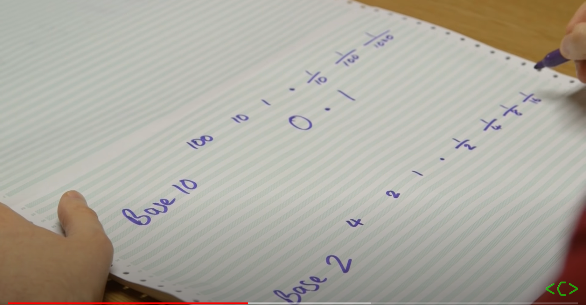
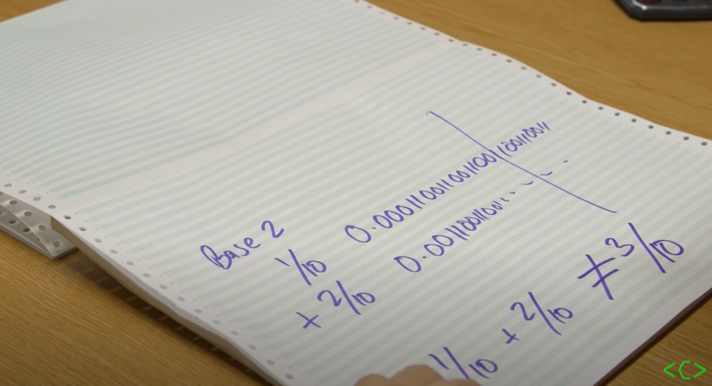
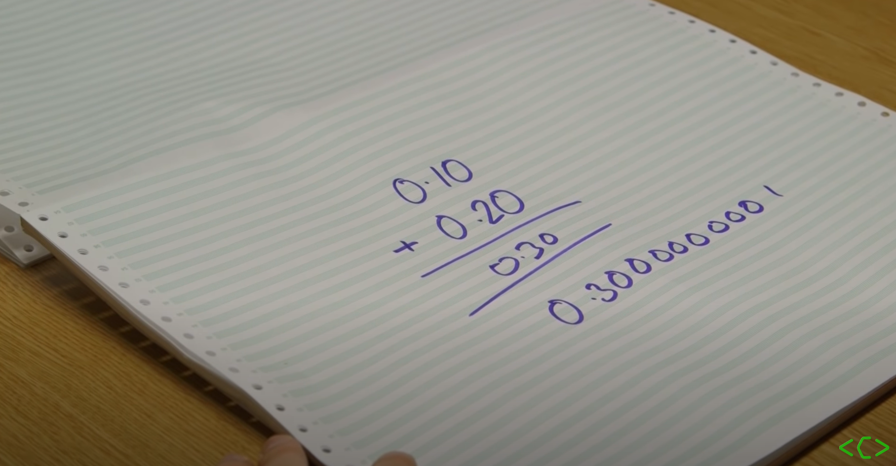
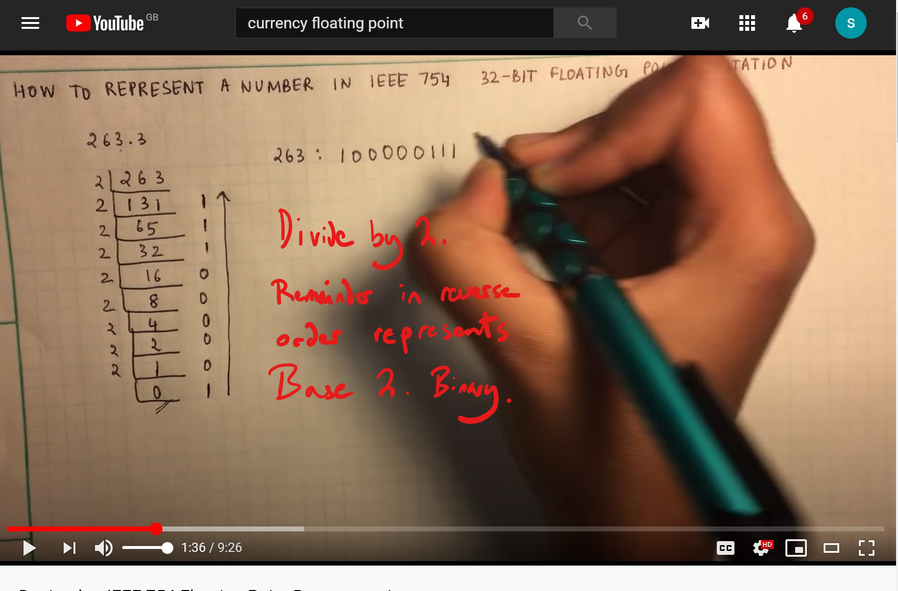
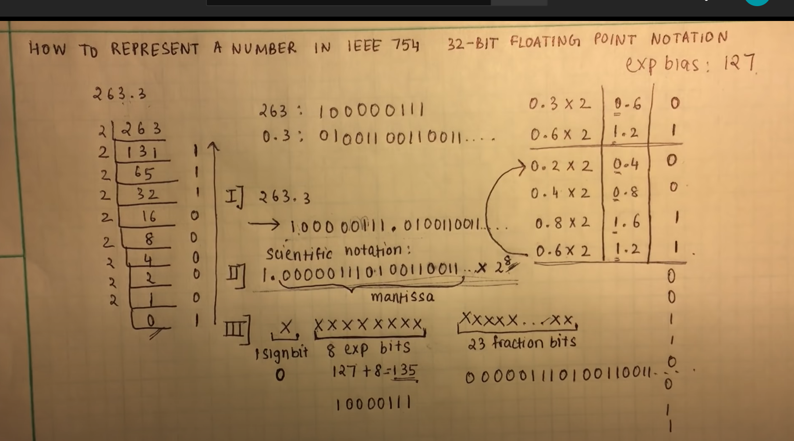
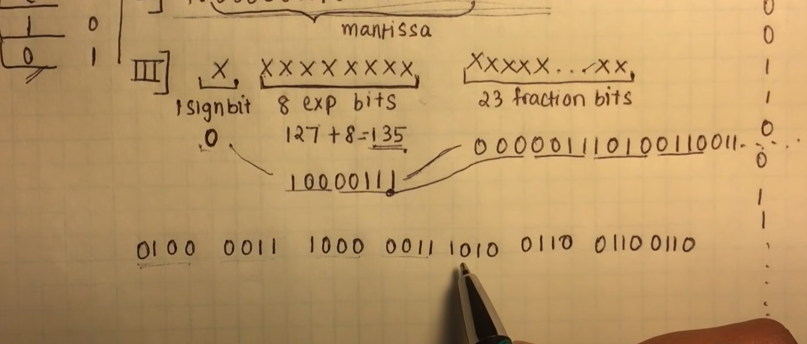

# What Every Computer Scientist Should Know About Floating-Point Arithmetic

## Rounding Error

Squeezing infinitely many real numbers into a finite number of bits requires an approximate representation. Although there are infinitely many integers, in most programs the result of integer computations can be stored in 32 bits. In contrast, given any fixed number of bits, most calculations with real numbers will produce quantities that cannot be exactly represented using that many bits. Therefore the result of a floating-point calculation must often be rounded in order to fit back into its finite representation. This rounding error is the characteristic feature of floating-point computation.

https://www.youtube.com/watch?v=PZRI1IfStY0 

### Advantages of Floating Point
- Speed
  - An established method of approximation
- Efficiency
  - Deals with very small and very big numbers extremely efficiently using approximations for real numbers.

### Base

Base 10 is the way we represent numbers in day to day life. 



Binary represents numbers using base 2. Converting between Base 10 and Base 2 Creates some efficiency issues:

```0.1 in Base 10 --> 0.000110011001100...```

32 bit computers only store 23 significant digits and store where the decimal point is. Calculations are carried out in Base 2. 

The floating-point method therefore results in reduced precision as it cannot deal with recusion and the issue of converting Base 10 to Base 2.

### EG - an analogy in Base 10

.png)

1/3 is an infinitely recuring number when represented in Base 10.

In floating-point math, the recursion isn't represented precisely: 
```1/3 x 3 = 0.9999999999999...```

This is a floating-point rounding error.

### Eg - Base 2 example



-----

64 bit has deals with floating-point calculations using more significant figures and is more precice.

## The issue : currency.



Solving this requires use of a decimal type in more advanced programming languages or storing as integers. Eg Separating considering ponds as pence. 

## Converting to Base 2:
https://www.youtube.com/watch?v=8afbTaA-gOQ 

Integers: 


Decimals:

.png)

- Multiply the decimal x 2 - then note the integral part. Continue until a loop is reached.

 - Combine and convert to Scientific Notation by multiplying by 2^x.

## Converting Base 2 to IEEE 754 format:
  - Signbit 
    -  positive numbers = 0
    -  negative numbers = 1
  
 -  8 exp bits
    -  for positive numbers
       -  add x to exp bias (127)
       -  convert to binary
  - 23 Fraction Bits
    - mantissa
    - bits following the decimal in the scientific notation.
  - Then combine the elements as below:



