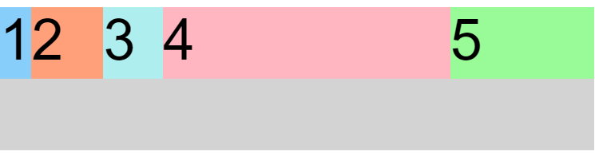
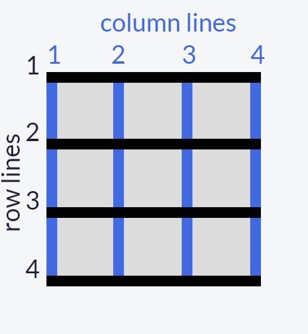

# display : grid

Turn any HTML element into a grid container by setting its display property to grid. This gives you the ability to use all the other properties associated with CSS Grid.

Simply creating a grid element doesn't get you very far. You need to define the structure of the grid as well. To add some columns to the grid, use the grid-template-columns property on a grid container as demonstrated below:

```
.container {
  display: grid;
  grid-template-columns: 50px 50px;
}
```

This will give your grid two columns that are each 50px wide. The number of parameters given to the grid-template-columns property indicates the number of columns in the grid, and the value of each parameter indicates the width of each column.

The grid-template-columns propoerty sets the number of rows automatically. To adjust the rows manually, use the ```grid-template-rows```
property.

You can use absolute and relative units like px and em in CSS Grid to define the size of rows and columns. You can use these as well:

fr: sets the column or row to a fraction of the available space,

auto: sets the column or row to the width or height of its content automatically,

%: adjusts the column or row to the percent width of its container.

Here's the code that generates the output in the preview:

```grid-template-columns: auto 50px 10% 2fr 1fr;```



This snippet creates five columns. The first column is as wide as its content, the second column is 50px, the third column is 10% of its container, and for the last two columns; the remaining space is divided into three sections, two are allocated for the fourth column, and one for the fifth.

## grid-column-gap

To add a gap between the columns, use the grid-column-gap property like this:

```grid-column-gap: 10px;```

You can add a gap in between the rows of a grid using ```grid-row-gap```

```grid-gap``` is a shorthand property for grid-row-gap and grid-column-gap from the previous two challenges that's more convenient to use. If grid-gap has one value, it will create a gap between all rows and columns. However, if there are two values, it will use the first one to set the gap between the rows and the second value for the columns.

## grid-column; & grid-row;

Up to this point, all the properties that have been discussed are for grid containers. The grid-column property is the first one for use on the grid items themselves.

The hypothetical horizontal and vertical lines that create the grid are referred to as lines. These lines are numbered starting with 1 at the top left corner of the grid and move right for columns and down for rows, counting upward.

This is what the lines look like for a 3x3 grid:



To control the amount of columns an item will consume, you can use the grid-column property in conjunction with the line numbers you want the item to start and stop at.

Here's an example:

```grid-column: 1 / 3;```

This will make the item start at the first vertical line of the grid on the left and span to the 3rd line of the grid, consuming two columns.

Of course, you can make items consume multiple rows just like you can with columns. You define the horizontal lines you want an item to start and stop at using the grid-row property on a grid item.

## justify-self: & align-self:

In CSS Grid, the content of each item is located in a box which is referred to as a cell. You can align the content's position within its cell horizontally using the justify-self property on a grid item. By default, this property has a value of ```stretch```, which will make the content fill the whole width of the cell. This CSS Grid property accepts other values as well:

- start: aligns the content at the left of the cell,

- center: aligns the content in the center of the cell,

- end: aligns the content at the right of the cell.

Just as you can align an item horizontally, there's a way to align an item vertically as well. To do this, you use the align-self property on an item. This property accepts all of the same values as ```justify-self```.

## justify-items: & align-items:

```justify-items``` can accept all the same values, the difference being that it will move all the items in our grid to the desired alignment.

```align-items``` applies alignment to all items within the grid element

## Dividing the Grid : Area Template

You can group cells of your grid together into an area and give the area a custom name. Do this by using grid-template-areas on the container like this:
```
grid-template-areas:
  "header header header"
  "advert content content"
  "footer footer footer";
```
The code above merges the top three cells together into an area named header, the bottom three cells into a footer area, and it makes two areas in the middle row; advert and content. Note: Every word in the code represents a cell and every pair of quotation marks represent a row. In addition to custom labels, you can use a period ```.``` to designate an empty cell in the grid.

After creating an area's template for your grid container, you can place an item in your custom area by referencing the name you gave it. To do this, you use the grid-area property on an item like this:

```
.item1 {
  grid-area: header;
}
```

This lets the grid know that you want the item1 class to go in the area named header.

Eg:
```
<style>
  .item1{background:LightSkyBlue;}
  .item2{background:LightSalmon;}
  .item3{background:PaleTurquoise;}
  .item4{background:LightPink;}

  .item5 {
    background: PaleGreen;
    /* Only change code below this line */
    grid-area: footer;
    
    /* Only change code above this line */
  }

  .container {
    font-size: 40px;
    min-height: 300px;
    width: 100%;
    background: LightGray;
    display: grid;
    grid-template-columns: 1fr 1fr 1fr;
    grid-template-rows: 1fr 1fr 1fr;
    grid-gap: 10px;
    grid-template-areas:
      "header header header"
      "advert content content"
      "footer footer footer";
  }
</style>

<div class="container">
  <div class="item1">1</div>
  <div class="item2">2</div>
  <div class="item3">3</div>
  <div class="item4">4</div>
  <div class="item5">5</div>
</div>
```
<style>
  .item1{background:LightSkyBlue;}
  .item2{background:LightSalmon;}
  .item3{background:PaleTurquoise;}
  .item4{background:LightPink;}

  .item5 {
    background: PaleGreen;
    /* Only change code below this line */
    grid-area: footer;
    
    /* Only change code above this line */
  }

  .container {
    font-size: 40px;
    min-height: 300px;
    width: 100%;
    background: LightGray;
    display: grid;
    grid-template-columns: 1fr 1fr 1fr;
    grid-template-rows: 1fr 1fr 1fr;
    grid-gap: 10px;
    grid-template-areas:
      "header header header"
      "advert content content"
      "footer footer footer";
  }
</style>

<div class="container">
  <div class="item1">1</div>
  <div class="item2">2</div>
  <div class="item3">3</div>
  <div class="item4">4</div>
  <div class="item5">5</div>
</div>

If your grid doesn't have an areas template to reference, you can create an area on the fly for an item to be placed like this:

```item1 { grid-area: 1/1/2/4; }```

This is using the line numbers you learned about earlier to define where the area for this item will be. The numbers in the example above represent these values:

```grid-area: horizontal line to start at / vertical line to start at / horizontal line to end at / vertical line to end at;```

So the item in the example will consume the rows between lines 1 and 2, and the columns between lines 1 and 4.

## Repeat

When you used grid-template-columns and grid-template-rows to define the structure of a grid, you entered a value for each row or column you created.

Let's say you want a grid with 100 rows of the same height. It isn't very practical to insert 100 values individually. Fortunately, there's a better way - by using the repeat function to specify the number of times you want your column or row to be repeated, followed by a comma and the value you want to repeat.

Here's an example that would create the 100 row grid, each row at 50px tall.

```grid-template-rows: repeat(100, 50px);```

You can also repeat multiple values with the repeat function and insert the function amongst other values when defining a grid structure. Here's what that looks like:

```grid-template-columns: repeat(2, 1fr 50px) 20px;```

This translates to:

```grid-template-columns: 1fr 50px 1fr 50px 20px;```

Note: The 1fr 50px is repeated twice followed by 20px.

## minmax Function

There's another built-in function to use with grid-template-columns and grid-template-rows called minmax. It's used to limit the size of items when the grid container changes size. To do this you need to specify the acceptable size range for your item. Here is an example:

```grid-template-columns: 100px minmax(50px, 200px);```

In the code above, grid-template-columns is set to create two columns; the first is 100px wide, and the second has the minimum width of 50px and the maximum width of 200px.

## auto-fill & auto-fit

The repeat function comes with an option called auto-fill. This allows you to automatically insert as many rows or columns of your desired size as possible depending on the size of the container. You can create flexible layouts when combining auto-fill with minmax, like this:

```repeat(auto-fill, minmax(60px, 1fr));```

When the container changes size, this setup keeps inserting 60px columns and stretching them until it can insert another one. Note: If your container can't fit all your items on one row, it will move them down to a new one.

In the first grid, use ```auto-fill``` with repeat to fill the grid with columns that have a minimum width of 60px and maximum of 1fr. Then resize the preview to see auto-fill in action.

```auto-fit``` works almost identically to auto-fill. The only difference is that when the container's size exceeds the size of all the items combined, auto-fill keeps inserting empty rows or columns and pushes your items to the side, while auto-fit collapses those empty rows or columns and stretches your items to fit the size of the container.

## Dynamic Grids

CSS Grid can be an easy way to make your site more responsive by using media queries to rearrange grid areas, change dimensions of a grid, and rearrange the placement of items.

In the preview, when the viewport width is 300px or more, the number of columns changes from 1 to 2. The advertisement area then occupies the left column completely.

When the viewport width is 400px or more, the header and footer areas occupy the top and bottom rows completely. 

Eg:
```
<style>
  .item1 {
    background: LightSkyBlue;
    grid-area: header;
  }

  .item2 {
    background: LightSalmon;
    grid-area: advert;
  }

  .item3 {
    background: PaleTurquoise;
    grid-area: content;
  }

  .item4 {
    background: lightpink;
    grid-area: footer;
  }

  .container2 {
    font-size: 1.5em;
    min-height: 300px;
    width: 100%;
    background: LightGray;
    display: grid;
    grid-template-columns: 1fr;
    grid-template-rows: 50px auto 1fr auto;
    grid-gap: 10px;
    grid-template-areas:
      "header"
      "advert"
      "content"
      "footer";
  }

  @media (min-width: 300px){
    .container2{
      grid-template-columns: auto 1fr;
      grid-template-rows: auto 1fr auto;
      grid-template-areas:
        "advert header"
        "advert content"
        "advert footer";
    }
  }

  @media (min-width: 400px){
    .container2{
      grid-template-areas:
      /* Only change code below this line */
        "header header"
        "advert content"
        "footer footer";
      /* Only change code above this line */
    }
  }
</style>

<div class="container2">
  <div class="item1">header</div>
  <div class="item2">advert</div>
  <div class="item3">content</div>
  <div class="item4">footer</div>
</div>
```

<style>
  .item1 {
    background: LightSkyBlue;
    grid-area: header;
  }

  .item2 {
    background: LightSalmon;
    grid-area: advert;
  }

  .item3 {
    background: PaleTurquoise;
    grid-area: content;
  }

  .item4 {
    background: lightpink;
    grid-area: footer;
  }

  .container2 {
    font-size: 1.5em;
    min-height: 300px;
    width: 100%;
    background: LightGray;
    display: grid;
    grid-template-columns: 1fr;
    grid-template-rows: 50px auto 1fr auto;
    grid-gap: 10px;
    grid-template-areas:
      "header"
      "advert"
      "content"
      "footer";
  }

  @media (min-width: 300px){
    .container2{
      grid-template-columns: auto 1fr;
      grid-template-rows: auto 1fr auto;
      grid-template-areas:
        "advert header"
        "advert content"
        "advert footer";
    }
  }

  @media (min-width: 400px){
    .container2{
      grid-template-areas:
      /* Only change code below this line */
        "header header"
        "advert content"
        "footer footer";
      /* Only change code above this line */
    }
  }
</style>

<div class="container2">
  <div class="item1">header</div>
  <div class="item2">advert</div>
  <div class="item3">content</div>
  <div class="item4">footer</div>
</div>

## Grids within Grids within Grids...

Turning an element into a grid only affects the behavior of its direct descendants. So by turning a direct descendant into a grid, you have a grid within a grid.

Eg:
```
<style>
  .container {
    font-size: 1.5em;
    min-height: 300px;
    width: 100%;
    background: LightGray;
    display: grid;
    grid-template-columns: auto 1fr;
    grid-template-rows: auto 1fr auto;
    grid-gap: 10px;
    grid-template-areas:
      "advert header"
      "advert content"
      "advert footer";
  }
  .item1 {
    background: LightSkyBlue;
    grid-area: header;
  }

  .item2 {
    background: LightSalmon;
    grid-area: advert;
  }

  .item3 {
    background: PaleTurquoise;
    grid-area: content;
    /* Only change code below this line */
    display: grid;
    grid-template-columns: auto 1fr;
    /* Only change code above this line */
  }

  .item4 {
    background: lightpink;
    grid-area: footer;
  }

  .itemOne {
    background: PaleGreen;
  }

  .itemTwo {
    background: BlanchedAlmond;
  }

</style>

<div class="container">
  <div class="item1">header</div>
  <div class="item2">advert</div>
  <div class="item3">
    <div class="itemOne">paragraph1</div>
    <div class="itemTwo">paragraph2</div>
  </div>
  <div class="item4">footer</div>
</div>
```
<style>
  .container3 {
    font-size: 1.5em;
    min-height: 300px;
    width: 100%;
    background: LightGray;
    display: grid;
    grid-template-columns: auto 1fr;
    grid-template-rows: auto 1fr auto;
    grid-gap: 10px;
    grid-template-areas:
      "advert header"
      "advert content"
      "advert footer";
  }
  .item1 {
    background: LightSkyBlue;
    grid-area: header;
  }

  .item2 {
    background: LightSalmon;
    grid-area: advert;
  }

  .item3 {
    background: PaleTurquoise;
    grid-area: content;
    /* Only change code below this line */
    display: grid;
    grid-template-columns: auto 1fr;
    /* Only change code above this line */
  }

  .item4 {
    background: lightpink;
    grid-area: footer;
  }

  .itemOne {
    background: PaleGreen;
  }

  .itemTwo {
    background: BlanchedAlmond;
  }

</style>

<div class="container3">
  <div class="item1">header</div>
  <div class="item2">advert</div>
  <div class="item3">
    <div class="itemOne">paragraph1</div>
    <div class="itemTwo">paragraph2</div>
  </div>
  <div class="item4">footer</div>
</div>


