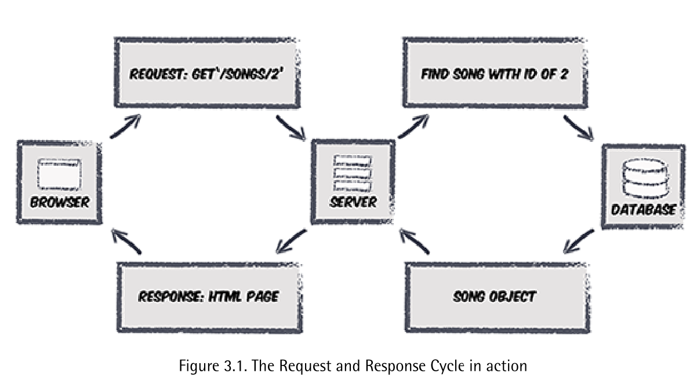

# RESTful URLs

Restful URLs are characteristically short and descriptive; because they describe a specific resource, they should contain nouns. What you want to do with the resource (“get” it or “delete” it, for example) is described by the verbs you use, or, more precisely, the HTTP verbs we saw before! If you want to know more about REST, this article by Ryan Tomayko is very informative.10

A common pattern, popularized by the Ruby on Rails framework, is that each resource should have the following URLs:

■ a list URL that displays all the resources; for example, /songs 

■ a show URL that shows an individual resource; for example, /songs/2

■ a new URL where you can enter the information for a new resource; for example, /songs/new

■ a create URL that will actually create new resource; for example, /songs

■ an edit view where you can update the information about a resource; for example, /songs/2/edit

■ an update URL that will actually update the resource; for example, /songs/2 

■ a delete URL that will remove a resource; for example, /songs/2

One aspect to notice with this approach is that a number ofview, update, and delete operations all have the same URL (/songs/2 in the examples just shown). The operation that’s carried out is purely determined by the HTTP verb used. For example, the URL /song/2 will show the song if it’s a GET request, but update the song if it’s a PUT request.

