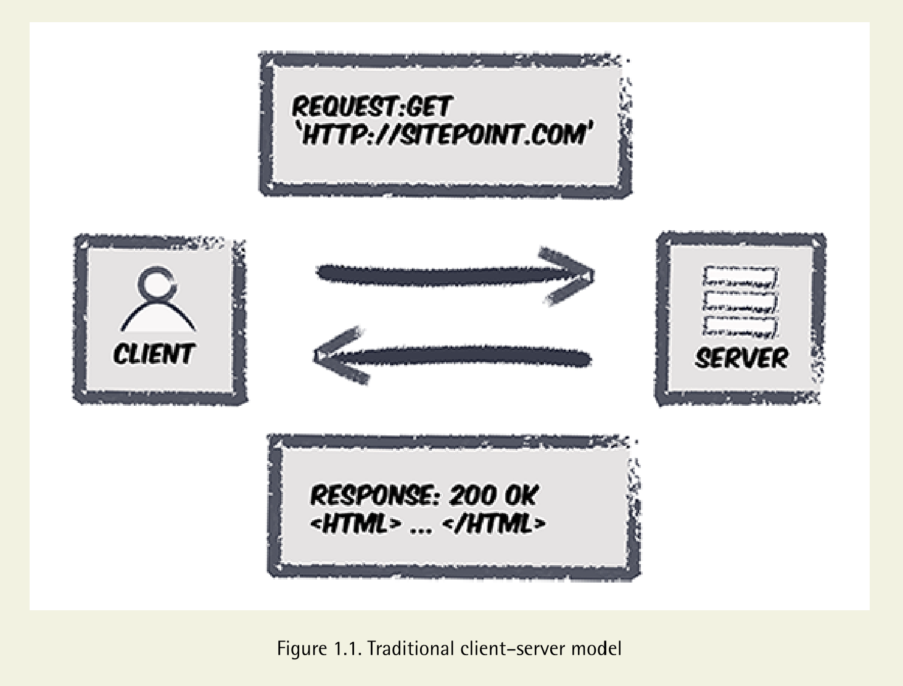

# HTTP

HTTP is the Hypertext Transfer Protocol, and it’s what makes the Web go round. This network protocol allows communication over the Internet between clients and servers. A client (such as a web browser) will request a resource (usually a web page) from a server, which processes the request and sends back a response to the client. This response contains a status code (usually 200, which indicates that everything is okay), and the requested resource that’s usually in the form of a web page. The requests and responses are messages sent via HTTP. Figure 1.1 shows how that works.

-----

# HTTP Verbs

When a client (usually a browser) makes a request to the server, it contains information about which HTTP verb to use. An HTTP verb tells the server what type of request is being made, which determines how the server deals with the request.

There are a number of HTTP verbs, but in practice we tend to only use five when dealing with resources on the Web: 

■ GET requests are used to retrieve resources. 

■ POST requests are usually employed to create a resource but can actually perform any task.

■ PUT requests are used to “upsert,” which means it can insert a resource or update it in its entirety.

■ PATCH requests make partial updates to a resource. 

■ DELETE requests are used to delete resources

----

## Idempotence
When a function is applied multiple times to something, but without changing the result after the first application, it is said to be idempotent. In terms of HTTP methods, this means that a request could be made numerous times, but the result will remain the same after the first successful request. GET, PUT, and DELETE are all expected to be idempotent methods. This means that a browser could theoretically repeat a request if it suspected the first had failed and could expect the same results, even if it ends up that both requests are processed. POST requests, on the other hand, are not idempotent and can change a resource (or several) by sending the same request repeatedly.

-----

