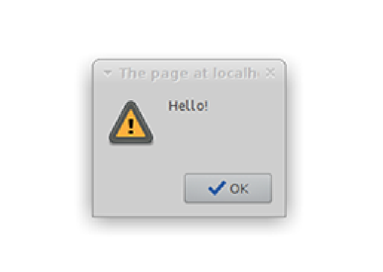

# CoffeeScript

A compiler used to integrate Javascript in into Sinatra Applications. 

```
gem install coffee-script therubyracer
```

Now we require the V8 engine and CoffeeScript in our application by adding this line to the top the Sinatra App

```
require 'v8' 
require 'coffee-script'
```

Good practice dictates that we put our JavaScript in a separate file with a new ./javascripts/ folder. This needs a link to the relevant .erb

```
script src="/javascripts/application.js"
```
then within the app put:

```
get('/javascripts/application.js'){ coffee :application } 
```

This employs the coffee helper method to tell Sinatra to process the request using CoffeeScript.

Then all you need is a .coffee file within stored within the views folder for Coffee to work with.

eg:

./views/application.coffee

```
alert 'Hello'
```

